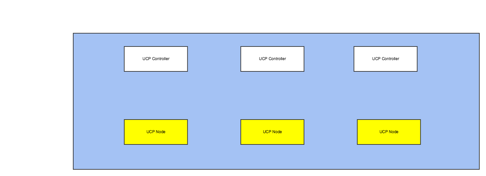
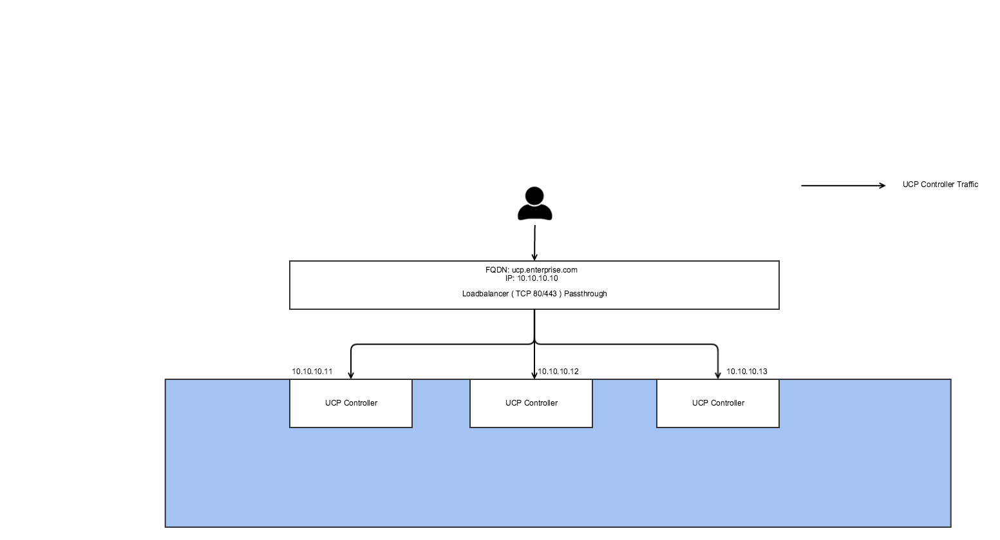
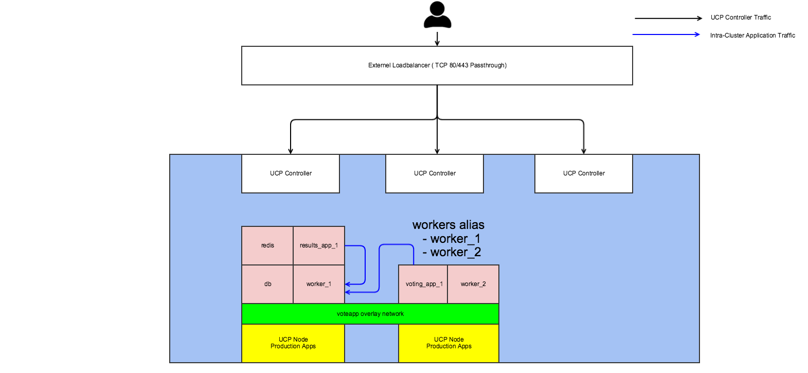
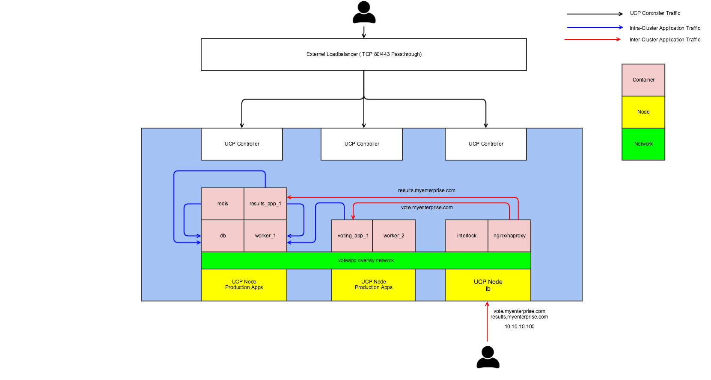
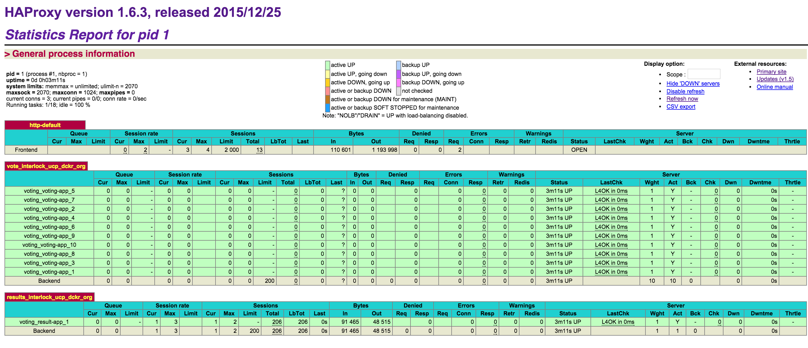

## Reference Architecture: Service Discovery and Load-Balancing with Docker Universal Control Plane (UCP)

### Introduction

When developing applications, developers focus on functionality, speed, robustness, and quality of the application itself more than the ongoing operations. However, the shift to DevOps in application deployment practices has forced developers to own not only the application's development but also its deployment operations (developers are no longer pager-duty-free!). This shift also encouraged the operations teams to provide a common, scalable, and secure infrastructure that multiple developer teams can use to build, test, stage and deploy their applications.  

With the new shift, DevOps teams want to ensure that their applications are scalable. This means that these applications need to be broken up into, built, and advertised as smaller, decoupled _microservices_ that can be easily scaled across large compute clusters. The _microservices_ approach emphasized two key architectural considerations: **service discovery and load balancing**. This means that as developers build their applications to scale, they need to consider and design how each component (_service_) is being discovered by other services within or from outside the cluster. Additionally, as these services scale horizontally across the cluster, they should be equally utilized for maximum load distribution. 

Docker Universal Control Plane (UCP) was built with this operational shift in mind. Docker UCP is available as part of Docker Datacenter to address both the developers’ requirement for a seamless path from development to production and IT Operations’ requirement for building a secure and scalable Docker infrastructure. Docker Datacenter includes UCP, Trusted Registry and Commercially Supported Docker Engines. As an integrated platform, Docker Datacenter empowers application teams to build a Containers as a Service (CaaS) environment either on-premises or in the cloud.

### What You Will Learn

In this reference architecture, you will learn how to setup your highly-available UCP cluster to enable dynamic built-in service discovery and load balancing. We will use a sample Dockerized application (Voting App) throughout this paper as a reference app. The sample app is composed of five (5) microservices as described below. The end goal is to:

* Deploy the app on UCP 

* Ensure that all of its services are discoverable within the cluster 

* Ensure two of its services are accessible and load-balanced from outside the cluster with pre-determined DNS names
 

**Sample Application Architecture:**

* **voting-app**: A Python webapp which lets you vote between two options. (External DNS: vote.myenterprise.com)
* **result-app**: A Node.js webapp which shows the results of the voting in real time (External DNS: results.myenterprise.com)
* **redis**: A Redis queue which collects new votes
* **worker**: A Java worker which consumes votes and stores them in…
* **db**: A Postgres database backed by a Docker volume

**Sample Application Docker Compose File:**

```
version: "2"

services:
  voting-app:
    image: docker/example-voting-app-voting-app
    ports:
      - "80"
    networks:
      - voteapp
  result-app:
    image: docker/example-voting-app-result-app
    ports:
      - "80"
    networks:
      - voteapp
  worker:
    image: docker/example-voting-app-worker
    networks:
      - voteapp
  redis:
    image: redis
    ports:
      - "6379"
    networks:
      - voteapp
    container_name: redis
  db:
    image: postgres:9.4
    volumes:
      - "db-data:/var/lib/postgresql/data"
    networks:
      - voteapp
    container_name: db
volumes:
  db-data:

networks:
  voteapp:


```

### Assumptions
This reference architecture assumes that the reader already has a working understanding of the Docker Datacenter, in particular the following components: Docker Universal Control Plane, Swarm, and Compose.  If you are not familiar, please refer to the  following resources:

- Basic understanding of [Docker UCP](https://www.docker.com/products/docker-universal-control-plane)
- Basic understanding of [Docker Swarm](https://docs.docker.com/swarm) 
- Basic understanding of [Docker Compose](https://docs.docker.com/compose)
- Basic understanding of common load balancing solutions such as [HAProxy](http://www.haproxy.org/) or [NGINX](https://www.nginx.com/)

### Requirements
There are software version requirements for this reference architecture.  Other variations have not been tested or validated.  For more details on software compatibility and interoperability please go to [Compatibility Matrix](http://www.docker.com/compatibility-maintenance) page.

- Docker UCP 1.0.0
- Docker Compose 1.6.1
- Commercially Supported Docker Engine 1.10

### Prerequisites
For this reference architecture, you will need the following environment setup. 

**Note:**  No need to install UCP yet. You will install UCP in a later step.

-  At least 3 UCP Controllers Nodes.
-  At least 3 UCP Cluster Nodes. 
-  A designated DNS record for UCP (e.g ucp.myenterprise.com).





### Design Considerations

There are multiple considerations for designing production-ready infrastructure using Docker Datacenter:

From an operational point of view, it is important to ensure that UCP itself is highly available so that any failure in one or more UCP controllers wouldn't result in an inability to access the UCP controller. Additionally, providing a scalable, secure, and stateless load-balancing service for **all** applications is important so that as the application scales, load-balancing can dynamically ensure that traffic is equally distributed across all of the containers providing these services. 

From a developer's point of view, it is important to ensure that any design should integrate with the established developer workflow. For example, if developers use Docker Compose to build their applications locally during development, the new design should ensure Compose files can also be used to deploy to production. Either directly by the developers or through a coordinated sign-off process to the deployment operations team. Additionally, it is important to ensure that each service deployed on Docker Datacenter is easily discoverable and reachable by other services that are part of the same app, regardless where the containers providing these service are deployed in the cluster. This means that developers can assume that moving their apps from local development to production cluster will not break the application. Finally, it is crucial to ensure that the developers' apps are easily discoverable and accessible from outside the cluster  regardless which cluster or cluster node they end up being deployed to. This means that as the app moves from one cluster to another, developers should not worry about losing access to their applications.


In summary, there are three key design considerations that need to be addressed to ensure the developers and operations' requirements are met:

-  UCP High-Availability
-  Internal Service Discovery + Load Distribution
-  External Service Discovery + Load Distribution

### Solution Overview

In the following sections, we will go through each of the three design considerations and provide a solution to address them. We will start by building a highly available UCP cluster that can withstand controller failure without impacting deployment operations. We will then focus on addressing the concern of intra cluster services discovery. Finally, we will go through designing a highly-scalable loadbalancing infrastructure that uses industry standards.


## 1. UCP High-Availability 


Docker UCP supports high availability (HA) by replicating the UCP controller along with the underlying Swarm manager and key-value store containers within your cluster. When you deploy UCP, you start by deploying the first UCP controller followed by the replicas. Functionally, all controllers are the same. HA requires at least three (3) controllers, a primary and two replicas , to be configured on three separate nodes. It is not recommended to run a cluster with only the primary controller and a single replica as this results in a split-brain scenario (e.g each controller thinks it is the master controller in the cluster). Failure tolerance for UCP HA deployments can be summarized as follows:


| Number Of Deployed Controllers | Failure Tolerance |
|-----------------------|-------------------|
| 1                     | 0                 |
| 3                     | 1                 |
| 5                     | 2                 |
| 7                     | 3                 |


UCP controllers are stateless by design. All UCP controllers accept requests, and then forward them to the underlying Swarm Manager. Any controller failure when UCP is deployed in HA will not have any impact on your UCP cluster, both from UCP web access (UI) or underlying cluster management perspectives (CLI). However, if you're statically mapping a DNS record to a primary UCP controller's IP address and that controller goes down, you will not be able to reach UCP. For that reason, it is recommended to deploy a UCP controller load balancer. An upstream load balancer can distribute all UCP requests to all three controllers behind it. As a sample reference, an HAProxy loadbalancer config file is provided below. Similarly, if you're deploying UCP in a public cloud, you can create a loadbalancer directly from the cloud provider ( AWS's ELB or Azure's Load Balancer)





```
global
  maxconn 256

defaults
  mode tcp
  timeout connect 5000ms
  timeout client 50000ms
  timeout server 50000ms

frontend public
  option tcplog
  bind *:80
  redirect scheme https code 301 if !{ ssl_fc }
  bind *:443
  default_backend servers

backend servers
  mode tcp
  balance roundrobin
  server ucp1 10.10.10.11:443 check
  server ucp2 10.10.10.12:443 check
  server ucp3 10.10.10.13:443 check


```

Here are some recommended UCP controller and load balancer configurations:

**Health Checks**: The load balancer can use UCP's API endpoint `/_ping` to ensure that each of the controllers is healthy. A `200 OK` response means that the controller is healthy and it can receive traffic. 

**Listeners**:  The load balancer should be configured to load balance using TCP port 80 and 443 to all three nodes in the cluster. The load balancer should **not** terminate/reestablish HTTPS connections due to mutual TLS connection requirement in order to use Docker Client with UCP. 

**DNS**: a DNS record should be mapped to the load balancer itself (e.g VIP) and not to any individual controller.

**IPs**: The load balancer can load balance to the controller's  private or public IPs. 

**SSL Certificates**: When you install the UCP controllers, ensure that you use the Fully Qualified Domain Name (FQDN) of the UCP when asked for additional Subject Alternative Names(SAN). You need to do this on **ALL** UCP controllers (including the replicas). The SANs are used by UCP's CA to sign SSL certificates.

If you would like to use your own CA to sign UCP's certificate, please follow the following directions [directions](https://docs.docker.com/ucp/production-install/#step-5-customize-the-ca-used-optional).

Should any controller fail, the UCP Controller load balancer will ensure that UCP can be reached and all Docker deployment workflows are run without impact. 

Now that you have the full requirements for UCP HA deployment, you can easily deploy the UCP controllers and nodes by following [these](FIXME) instructions. 

Once you install and configure the UCP controllers, you can download the UCP Client Bundle to directly use your local Docker client to deploy containers on UCP. Instructions to obtain the Client Bundle are  [here](FIXME)

## 2. Internal Service Discovery + Load Distribution


In order for different microservice containers to communicate, they must first discover each other. The introduction of multi-host networking in Docker 1.9 enabled multiple services belonging to a single application to be connected via an [Overlay Network](https://docs.docker.com/engine/userguide/networking/get-started-overlay/) that spans multiple nodes. Docker 1.10 added an embedded DNS-based for hostname lookups for a more reliable and scalable service discovery. 

Containers deployed using Docker 1.10 can now use DNS to resolve the IP of other containers on the same network. This behaviour works out of the box for user-defined bridge and overlay networks.  

Docker 1.10 also introduced the concept of _network alias_. A network alias abstracts multiple containers under a single alias. This means that scaled services ( e.g `docker-compose scale service=number`) can be grouped under and resolved by a single alias. Docker will resolve the alias to a healthy container that belongs to that alias. This is extremely helpful for stateless services where any container can be used to provide a service. 

**Example** In our sample Voting App, the Java `worker` service can belong to the alias `workers`. If additional workers are needed, you can scale the `worker` service using Compose. All the `worker` services can belong to a single alias called `workers`. If other services need to connect with any of these services, Docker will resolve the `workers` alias to a healthy container. We can add network aliases for  the `worker` service in the Compose file as follows:


```

<snippet>

  worker:
    image: docker/example-voting-app-worker
    networks:
      - voteapp
    network_aliases:
      voteapp:
	    - workers			

<snippet>

```

We can now deploy the app on UCP using Docker Compose. The `worker` service is then scaled such that there are two containers running (`worker_1` and `worker_2`). Other services can reach either worker containers by using the container name `worker_1` or the alias name (`workers`). In the case that `worker_1` goes down, Docker automatically will resolved the `workers` alias to `worker_2`.




## 3. External Service Discovery + Load Distribution 

Some services are designed to be accessed from outside the UCP cluster (typically by a DNS name) either as services that need to be accessed by other services in a different cluster or by external public users/services. To access these services, you typically need to create a DNS record for each service, and map it to the exact node that that service is running on. If you also need to load balance across multiple containers, you need to add a load balancer and reconfigure it every time a container comes up/goes down. This process is tedious and unscalable. 

An easier, more scalable, and automated solution to enable external service discovery and load balancing is to use an event-driven service registrator that automatically updates a load-balancer's config as containers go up or down in your UCP cluster. This can be achieved by combining [Interlock](www.github.com/ehazlett/interlock) with your preferred load balancer [HAProxy](https://hub.docker.com/_/haproxy/) or [NGINX](https://hub.docker.com/_/nginx/).

Interlock is a containerized, event-driven tool that connects to the UCP controllers and watches for events. In this case, events can be containers being spun up or going down. Interlock also looks for certain metadata that these containers have. These can be hostnames or labels that you configure the container with. It then uses the metadata to register/de-register these containers to a load balancing backend. The load balancer uses updated backend configs to direct incoming requests to healthy containers. Both Interlock and the load balancer containers are stateless, and hence can be scaled horizontally across multiple nodes to provide a highly-available load balancing services for all deployed applications.


## How it Works:


First, you would need to configure Interlock. Interlock uses UCP's k/v store to store its configs. This enables a single update to the configuration to be used by multiple Interlock/LB instances (that is if you decide to deploy multiple instances of Interlock+lb).

Second, you would need to deploy Interlock and the load balancer containers on a regular UCP node(s). It is recommended to dedicate some nodes in a UCP cluster to provide the external connectivity and load balancing service. These nodes need to have externally routable IP addresses reachable by the services that need to access your application. The other nodes running your services do not have to have externally routable IP addresses. In this example we will one of the three UCP nodes (we will call it **lb**) to deploy Interlock and the loadbalancer using Docker Compose.


Third, you would need to create a DNS record that represents your application's domain name and map it to the IP address of **lb**. 

Finally, you need to add specific metadata in the form of container labels when deploying your application. The labels are then used by Interlock to register the container against the load balancer. 

The above steps provide the necessary service registration and load balancing solution that can be used by any developer when deploying their application on UCP. Follow the below step-by-step procedures to configure your UCP cluster based on your preferred industry-standard load balancing backend (NGINX or HAProxy). 




### 3A. Interlock and NGINX/NGINX+


The following steps provide a guideline to configuring the load-balancing solution on a dedicated UCP node using Interlock + NGINX/NGINX+:

The following steps provide a guideline to configuring the load-balancing solution on a dedicated UCP node using Interlock + NGINX/NGINX Plus:

1.  On **any** UCP Controller nodes, update Interlock configs using a single curl command against UCP key/value store. **Note**: We are using a sample NGINX config, full documentation for NGINX options can be found [here](https://github.com/ehazlett/interlock/blob/ng/docs/configuration.md). 

**Note:** You will notice that we're using the FQDN of UCP to load Interlock's configs to the K/V store. This will ensure that Interlock can reach and listen to events from any any controller. However, Interlock needs to access the UCP on port 2376 (default port of the Swarm Manager container). Therefore, you need to ensure that the UCP Controller Loadbalancer will allow traffic to that port to reach the controllers. Alternatively, you can configure an internal UCP loadbalanacer that doesn't restrict any ports to pass to the UCP controllers. 

```
$ export CONTROLLER_IP= ucp.myenterprise.com
```

followed by:

```
$ docker exec -ti ucp-kv curl \
  --cacert /etc/docker/ssl/ca.pem \
  --cert /etc/docker/ssl/cert.pem \
  --key /etc/docker/ssl/key.pem \
  https://$CONTROLLER_IP:12379/v2/keys/interlock/v1/config -XPUT -d value='listenAddr = ":8080"
dockerURL = "tcp://$CONTROLLER_IP:2376"
tlsCaCert = "/certs/ca.pem"
tlsCert = "/certs/cert.pem"
tlsKey = "/certs/key.pem"

[[Extensions]]
  Name = "nginx"
  ConfigPath = "/etc/conf/nginx.conf"
  PidPath = "/etc/conf/nginx.pid"
  BackendOverrideAddress = ""
  ConnectTimeout = 5000
  ServerTimeout = 10000
  ClientTimeout = 10000
  MaxConn = 1024
  Port = 80
  SyslogAddr = ""
  NginxPlusEnabled = false
  AdminUser = "admin"
  AdminPass = ""
  SSLCertPath = ""
  SSLCert = ""
  SSLPort = 443
  SSLOpts = ""
  User = "www-data"
  WorkerProcesses = 2
  RLimitNoFile = 65535
  ProxyConnectTimeout = 600
  ProxySendTimeout = 600
  ProxyReadTimeout = 600
  SendTimeout = 600
  SSLCiphers = "HIGH:!aNULL:!MD5"
  SSLProtocols = "SSLv3 TLSv1 TLSv1.1 TLSv1.2"'
```

**NOTE**: (FIXME) If CONTROLLER_IP doesn't get substituted by actual name/IP in curl command, edit the command manually and substitute your local IP of controller. 

2.  On the dedicated UCP node (**lb**), [install Docker Compose](https://docs.docker.com/compose/install/). Then ensure that docker-compose in installed :


```
$ docker-compose version
docker-compose version 1.6.0, build d99cad6
docker-py version: 1.7.0
CPython version: 2.7.6
OpenSSL version: OpenSSL 1.0.1f 6 Jan 2014

```

3.  On the dedicated UCP node (**lb**) , clone the [following repo](https://github.com/nicolaka/interlock-lbs). **Note:** In this example, we're using the standard NGINX Docker image. However, you can use your own NGINX+ image. All you need to do is change the image for the `nginx` service in the Docker Compose file and repeat step #1 with the `NginxPlusEnabled = true` option.


```
$ git clone https://github.com/nicolaka/interlock-lbs
```

4.  On the dedicated UCP node (**lb**), export an environment variable called **CONTROLLER_IP**. This variable should be the FQDN of UCP Controller.

	`$ export CONTROLLER_IP=ucp.myenterprise.com`

5.  On the dedicated UCP node (**lb**), deploy Interlock+NGINX using the following docker-compose command:

```
$ cd ./interlock-lbs/interlock-nginx
interlock-lbs/interlock-nginx$ docker-compose up -d
```

6.  Confirm that Interlock is connected to the Swarm event stream:


```
/interlock-lbs/interlock-nginx$ docker-compose logs
Attaching to interlocknginx_nginx_1, interlocknginx_interlock_1
interlock_1 | time="2016-02-21T04:12:28Z" level=info msg="interlock 1.0.0 (57c4f86)"
interlock_1 | time="2016-02-21T04:12:28Z" level=debug msg="using kv: addr=etcd://ucp.myenterprise.com:12379"
interlock_1 | time="2016-02-21T04:12:28Z" level=debug msg="Trusting certs with subjects: [0\x1e1\x1c0\x1a\x06\x03U\x04\x03\x13\x13UCP Cluster Root CA]"
interlock_1 | time="2016-02-21T04:12:28Z" level=debug msg="configuring TLS for KV"
interlock_1 | time="2016-02-21T04:12:29Z" level=debug msg="using tls for communication with docker"
interlock_1 | time="2016-02-21T04:12:29Z" level=debug msg="docker client: url=tcp://10.0.20.65:3376"
interlock_1 | time="2016-02-21T04:12:29Z" level=debug msg="loading extension: name=nginx configpath=/etc/conf/nginx.conf"
interlock_1 | time="2016-02-21T04:12:29Z" level=debug msg="starting event handling"
interlock_1 | time="2016-02-21T04:12:29Z" level=debug msg="checking to reload"
interlock_1 | time="2016-02-21T04:12:29Z" level=debug msg=reloading
interlock_1 | time="2016-02-21T04:12:29Z" level=debug msg="updating load balancers"
interlock_1 | time="2016-02-21T04:12:29Z" level=debug msg="event received: type= id="
interlock_1 | time="2016-02-21T04:12:29Z" level=info msg="configuration updated" ext=nginx
interlock_1 | time="2016-02-21T04:12:29Z" level=debug msg="reload duration: 505.20ms"
interlock_1 | time="2016-02-21T04:12:29Z" level=debug msg="event received: type= id="
interlock_1 | time="2016-02-21T04:12:29Z" level=debug msg="event received: type= id="
interlock_1 | time="2016-02-21T04:12:29Z" level=debug msg="event received: type=start id=0964bc585e971c43b69d08b440d2175d37b9c533b7e48026044a5694a4abeb5a"
interlock_1 | time="2016-02-21T04:12:29Z" level=debug msg="inspecting container: id=0964bc585e971c43b69d08b440d2175d37b9c533b7e48026044a5694a4abeb5a"
interlock_1 | time="2016-02-21T04:12:29Z" level=debug msg="checking container labels: id=0964bc585e971c43b69d08b440d2175d37b9c533b7e48026044a5694a4abeb5a"
interlock_1 | time="2016-02-21T04:12:29Z" level=debug msg="ignoring proxy container: id=0964bc585e971c43b69d08b440d2175d37b9c533b7e48026044a5694a4abeb5a"
interlock_1 | time="2016-02-21T04:12:31Z" level=debug msg="event received: type=attach id=0964bc585e971c43b69d08b440d2175d37b9c533b7e48026044a5694a4abeb5a"
interlock_1 | time="2016-02-21T04:12:31Z" level=debug msg="event received: type=attach id=a01eca3a526c9f3a7cac36c6ffd9ae01643f7e866da7a40a46a2eedc9b530f74"

```


### 3B. Interlock and HAProxy

The following steps provide a guideline to configuring the load-balancing solution using Interlock + HAProxy:

1. On **any** controller nodes, update Interlock configs using a single curl command against UCP k/v store. 

**Note** Please make sure to use your substitute your own password for HAProxy by updating the value of `adminPass`.

**Note**: We are using a sample HAProxy config, Full documentation on HAProxy options can be found [here](https://github.com/ehazlett/interlock/blob/ng/docs/configuration.md).

**Note:** You will notice that we're using the FQDN of UCP to load Interlock's configs to the K/V store. This will ensure that Interlock can reach and listen to events from any any controller. However, Interlock needs to access the UCP on port 2376 (default port of the Swarm Manager container). Therefore, you need to ensure that the UCP Controller Loadbalancer will allow traffic to that port. Alternatively, you can configure an internal UCP loadbalanacer that doesn't restrict any ports to pass to the UCP controllers.

```
$ export CONTROLLER_IP=ucp.myenterprise.com
```

followed by:

```
$ docker exec -ti ucp-kv curl \
  --cacert /etc/docker/ssl/ca.pem \
  --cert /etc/docker/ssl/cert.pem \
  --key /etc/docker/ssl/key.pem \
  https://$CONTROLLER_IP:12379/v2/keys/interlock/v1/config -XPUT -d value='listenAddr = ":8080"
dockerURL = "tcp://$CONTROLLER_IP:2376"
tlsCaCert = "/certs/ca.pem"
tlsCert = "/certs/cert.pem"
tlsKey = "/certs/key.pem"

[[extensions]]
name = "haproxy"
configPath = "/usr/local/etc/haproxy/haproxy.cfg"
pidPath = "/usr/local/etc/haproxy/haproxy.pid"
sslCert = ""
maxConn = 1024
port = 80
sslPort = 443
adminUser = "admin"
adminPass = "CHANGEME"'

```


**NOTE**: (FIXME) If CONTROLLER_IP doesn't get substituted by actual name/IP in curl command, edit the command manually and substitute your local IP of controller.


2. On the dedicated UCP node (**lb**), [install Docker Compose](https://docs.docker.com/compose/install/). Then ensure that docker-compose is installed: 

```
$ docker-compose version
docker-compose version 1.6.0, build d99cad6
docker-py version: 1.7.0
CPython version: 2.7.6
OpenSSL version: OpenSSL 1.0.1f 6 Jan 2014

```

3. On the dedicated UCP node (**lb**), clone the [following repo](https://github.com/nicolaka/interlock-lbs).


```
$ git clone https://github.com/nicolaka/interlock-lbs
```

4. On the dedicated UCP node (**lb**), export an environment variable called **CONTROLLER_IP**. This variable should be the FQDN of one of the UCP Controller. **Note**: Make sure to use the DNS/IP that was listed as a SAN when you created your UCP controllers.

	`$ export CONTROLLER_IP=ucp.myenterprise.com`
	
5. On the dedicated UCP node (**lb**), deploy Interlock+HAProxy using the following docker-compose command:

```
$ cd ./interlock-lbs/interlock-haproxy
interlock-lbs/interlock-haproxy$ docker-compose up -d
```


6. Confirm that Interlock is connected to the Swarm event stream:

```
interlock-lbs/interlock-haproxy$ docker-compose logs
Attaching to interlockhaproxy_haproxy_1, interlockhaproxy_interlock_1
haproxy_1   | [WARNING] 051/045104 (1) : config : log format ignored for frontend 'http-default' since it has no log address.
interlock_1 | time="2016-02-21T04:51:04Z" level=info msg="interlock 1.0.0 (57c4f86)"
interlock_1 | time="2016-02-21T04:51:04Z" level=debug msg="using kv: addr=etcd://ucp.myenterprise.com:12379"
interlock_1 | time="2016-02-21T04:51:04Z" level=debug msg="Trusting certs with subjects: [0\x1e1\x1c0\x1a\x06\x03U\x04\x03\x13\x13UCP Cluster Root CA]"
interlock_1 | time="2016-02-21T04:51:04Z" level=debug msg="configuring TLS for KV"
interlock_1 | time="2016-02-21T04:51:04Z" level=debug msg="using tls for communication with docker"
interlock_1 | time="2016-02-21T04:51:04Z" level=debug msg="docker client: url=tcp://10.0.20.65:3376"
interlock_1 | time="2016-02-21T04:51:04Z" level=debug msg="loading extension: name=haproxy configpath=/usr/local/etc/haproxy/haproxy.cfg"
interlock_1 | time="2016-02-21T04:51:04Z" level=debug msg="starting event handling"
interlock_1 | time="2016-02-21T04:51:04Z" level=debug msg="checking to reload"
interlock_1 | time="2016-02-21T04:51:04Z" level=debug msg=reloading
interlock_1 | time="2016-02-21T04:51:04Z" level=debug msg="updating load balancers"
interlock_1 | time="2016-02-21T04:51:04Z" level=debug msg="generating proxy config" ext=haproxy
interlock_1 | time="2016-02-21T04:51:04Z" level=debug msg="event received: type= id="
interlock_1 | time="2016-02-21T04:51:04Z" level=info msg="configuration updated" ext=haproxy
```


### Application Deployment Configuration

Now that Interlock+LB are up and configured to listen on Swarm events. You can start deploying your applications on the UCP cluster. Interlock expects specific container metadata via labels. A complete list of all Interlock options can be found [here](https://github.com/ehazlett/interlock/blob/ng/docs/interlock_data.md). 

In our sample app, we want to expose two services externally. These services are `voting-app` and `results-app`. For interlock to register these services as backends for the load balancer, we need to provide additional container labels. In our case, we want `voting-app` to be registered as `vote.myenterprise.com` and `results-app` as `results.myenterprise.com`. The DNS records need to be mapped to the IP addrress of (**lb**). You may also map a wildcard DNS record to the **lb**. To configure and deploy the app, follow the below steps:

1. From your local machine, download a UCP client bundle. Instructions can be found [here](FIXME).

2. Ensure that you have Docker Compose installed on your local environment. 
	
	```
	$ docker-compose version
	docker-compose version 1.6.0, build d99cad6
	docker-py version: 1.7.0
	CPython version: 2.7.6
	OpenSSL version: OpenSSL 1.0.1f 6 Jan 2014
	
	```


3. Ensure that you're pointing your local Docker client to the UCP controller:

	```
	$ cd /path/to/ucp-bundle-admin
	ucp-bundle-admin$ source env.sh
	```

Followed by:

```
	ucp-bundle-admin$ docker version
	Client:
	 Version:      1.10.1
	 API version:  1.22
	 Go version:   go1.5.3
	 Git commit:   9e83765
	 Built:        Thu Feb 11 19:27:08 2016
	 OS/Arch:      linux/amd64
	
	Server:
	 Version:      ucp/1.0.0
	 API version:  1.22
	 Go version:   go1.5.3
	 Git commit:   5c4f6d8
	 Built:
	 OS/Arch:      linux/amd64
```

4.  We need to adjust the app's Compose file to add the necessary Interlock labels. 

For `voting-app` we add the following:


	```
	    labels:
	     interlock.hostname: "vote"
	     interlock.domain:   "myenterprise.com"
	```


For `results-app` we add the following:

	```
	    labels:
	     interlock.hostname: "results"
	     interlock.domain:   "myenterprise.com"
	```

The complete docker-compose file now should like this :

	```
	version: "2"
	
	services:
	  voting-app:
	    image: docker/example-voting-app-voting-app
	    ports:
	      - "80"
	    networks:
	      - voteapp
	    labels:
	     interlock.hostname: "vote"
	     interlock.domain:   "myenterprise.com"
	  result-app:
	    image: docker/example-voting-app-result-app
	    ports:
	      - "80"
	    networks:
	      - voteapp
	    labels:
	     interlock.hostname: "results"
	     interlock.domain:   "myenterprise.com"
	  worker:
	    image: docker/example-voting-app-worker
	    networks:
	      - voteapp
	    network_aliases:
	      voteapp:
		    - workers	
	  redis:
	    image: redis
	    ports:
	      - "6379"
	    networks:
	      - voteapp
	    container_name: redis
	
	  db:
	    image: postgres:9.4
	    volumes:
	      - "db-data:/var/lib/postgresql/data"
	    networks:
	      - voteapp
	    container_name: db
	volumes:
	  db-data:
	
	networks:
	  voteapp:
	```
5. Deploy the app on UCP using Docker Compose:

	```
	voteapps$ docker-compose up -d
	```

6. On the **lb**, confirm that Interlock registered the apps with the load balancer by looking at its logs. You should see the "restarted proxy container" message if Interlock registered the container successfully.

	
	```
	interlock-lbs/interlock-haproxy$ docker-compose logs
	
	interlock_1 | time="2016-02-21T05:09:54Z" level=debug msg="adding host name=vote_myenterprise_com domain=vote.myenterprise.com" ext=haproxy
	interlock_1 | time="2016-02-21T05:09:54Z" level=info msg="configuration updated" ext=haproxy
	interlock_1 | time="2016-02-21T05:09:54Z" level=debug msg="dropping SYN packets to trigger client re-send" ext=haproxy
	interlock_1 | time="2016-02-21T05:09:54Z" level=debug msg="&{/sbin/iptables [/sbin/iptables -I INPUT -p tcp --dport 80 --syn -j DROP] []  <nil> <nil> <nil> [] <nil> <nil> <nil> <nil> false [] [] [] [] <nil>}" ext=haproxy
	interlock_1 | time="2016-02-21T05:09:54Z" level=warning msg="error signaling clients to resend; you will notice dropped packets: exit status 3" ext=haproxy
	interlock_1 | time="2016-02-21T05:09:54Z" level=debug msg="event received: type= id="
	interlock_1 | time="2016-02-21T05:09:54Z" level=debug msg="event received: type=kill id=608a397a7288d26932d3d83a912b1172a085c09d0eaf0d48be54dd282f3d3d49"
	interlock_1 | time="2016-02-21T05:09:56Z" level=info msg="restarted proxy container: id=608a397a7288 name=/lb/interlockhaproxy_haproxy_1" ext=haproxy
	```

7. You can now access the app by going to http://vote.myenterprise.com or http://results.myenterprise.com.

8.  If you need to scale the voting-app service, you can simply scale it using docker-compose. Interlock will add the newly added container to the voting-app backend. For example, if you're using HAProxy, you can see that the containers were added to the correct backend by going to the `http://vote.myenterprise.com/haproxy?stats`.

	```
	$ docker-compose scale voting-app=10
	Creating and starting 2 ... done
	Creating and starting 3 ... done
	Creating and starting 4 ... done
	Creating and starting 5 ... done
	Creating and starting 6 ... done
	Creating and starting 7 ... done
	Creating and starting 8 ... done
	Creating and starting 9 ... done
	Creating and starting 10 ... done
	```



## Summary

In this Reference Architecture, we set up a highly-available Docker Universal Control Plane (UCP) cluster and enabled dynamic built-in service discovery and load balancing by addressing three key design requirements : UCP High-Availability, Cluster Service Discovery + Load Distribution, and External Service Discovery + Load Distribution. Additionally, we provided sample configurations and workflows for deploying microservice applications on UCP.
